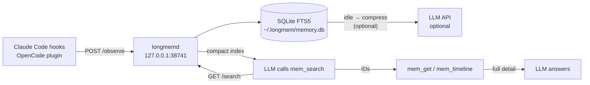

# LongMem

**Persistent memory for [OpenCode](https://opencode.ai) and [Claude Code CLI](https://claude.ai/code) — both, simultaneously, without freezing your model or polluting your chat.**

Every tool call, file edit, and prompt is captured and indexed in a local SQLite database. Three MCP tools (`mem_search`, `mem_get`, `mem_timeline`) let the LLM retrieve the past on demand — no auto-injection, no context bloat.

---

## Why you care

- **Stop repeating yourself.** Architecture decisions, debugging sessions, file locations — searchable across every future session.
- **No freeze.** Compression runs in a separate local daemon on its own idle timer, completely decoupled from your main model's API slot.
- **Clean chat.** Memory is retrieved via MCP tools only when the LLM asks for it — never injected automatically into every message.

---

## Demo

> GIF coming soon: `mem_search` finding a past debugging session in under 1s.

```
You: why was auth broken last week?

LLM calls → mem_search: "auth broken jwt"
→ [ID:142] 2026-02-28 | Edit | src/auth.ts
    Fixed JWT expiry — was comparing seconds vs milliseconds

LLM calls → mem_get: [142]
→ Full diff, concepts: jwt, expiry, middleware, auth

LLM: "Last week you fixed a JWT expiry bug in src/auth.ts — the check
      was comparing seconds against a milliseconds timestamp..."
```

---

## Quickstart

### Option A — One-line install (no Bun required)

Pre-compiled standalone binaries are published with each GitHub Release for macOS (arm64 / x64) and Linux (x64). The installer requires no runtime — just `curl`, `bash`, and `python3` (for JSON patching).

```bash
# Claude Code CLI only (default)
curl -fsSL https://github.com/clouitreee/LongMem/releases/latest/download/install.sh | bash

# Claude Code CLI + OpenCode
curl -fsSL https://github.com/clouitreee/LongMem/releases/latest/download/install.sh | bash -s -- --all

# OpenCode only
curl -fsSL https://github.com/clouitreee/LongMem/releases/latest/download/install.sh | bash -s -- --opencode-only
```

**Verify the daemon is running:**

```bash
curl -s http://127.0.0.1:38741/health
# → {"status":"ok","pending":0,"sessions":0}
```

> Binaries are built by GitHub Actions on each tagged release (`v*`). If no release exists yet, use Option B.

---

### Option B — Dev install (requires [Bun](https://bun.sh) ≥ 1.1)

```bash
git clone https://github.com/clouitreee/LongMem.git
cd LongMem
bun install
bun run build             # compile daemon + MCP + hooks
bun run install.ts        # configure Claude Code CLI
# or:
bun run install.ts --all  # configure Claude Code CLI + OpenCode
```

**Verify:**
```bash
curl -s http://127.0.0.1:38741/health
```

---

## Integrations

### A) Claude Code CLI

The installer patches `~/.claude/settings.json`. What gets added:

**Dev install** (`bun run install.ts`):
```json
{
  "hooks": {
    "PostToolUse":     [{ "matcher": "", "hooks": [{ "type": "command", "command": "/home/you/.bun/bin/bun /home/you/.longmem/hooks/post-tool.js" }] }],
    "UserPromptSubmit":[{ "matcher": "", "hooks": [{ "type": "command", "command": "/home/you/.bun/bin/bun /home/you/.longmem/hooks/prompt.js" }] }],
    "Stop":            [{ "matcher": "", "hooks": [{ "type": "command", "command": "/home/you/.bun/bin/bun /home/you/.longmem/hooks/stop.js" }] }]
  },
  "mcpServers": {
    "longmem": {
      "command": "/home/you/.bun/bin/bun",
      "args": ["/home/you/.longmem/mcp.js"]
    }
  }
}
```

**Binary install** (`install.sh`):
```json
{
  "hooks": {
    "PostToolUse":     [{ "matcher": "", "hooks": [{ "type": "command", "command": "/home/you/.longmem/bin/longmem-hook post-tool" }] }],
    "UserPromptSubmit":[{ "matcher": "", "hooks": [{ "type": "command", "command": "/home/you/.longmem/bin/longmem-hook prompt" }] }],
    "Stop":            [{ "matcher": "", "hooks": [{ "type": "command", "command": "/home/you/.longmem/bin/longmem-hook stop" }] }]
  },
  "mcpServers": {
    "longmem": {
      "command": "/home/you/.longmem/bin/longmem-mcp",
      "args": []
    }
  }
}
```

| Hook | What it does |
|------|-------------|
| `PostToolUse` | Captures tool name + input + output → sends to daemon (fire-and-forget) |
| `UserPromptSubmit` | Indexes the user prompt for full-text search |
| `Stop` | Signals session end so the daemon can finalize compression |

All hooks always exit `0` — they never block or break your Claude Code workflow.

---

### B) OpenCode

Install with `--opencode` or `--all`. The installer patches `~/.config/opencode/config.json`:

```json
{
  "instructions": ["/home/you/.opencode/memory-instructions.md"],
  "plugin": ["/home/you/.longmem/plugin.js"],
  "mcp": {
    "longmem": {
      "command": "/home/you/.longmem/bin/longmem-mcp",
      "args": []
    }
  }
}
```

- **`instructions`** — tells the model to call `mem_search` before answering. Without this, the LLM may never use memory tools.
- **`plugin`** — hooks into `tool.execute.after`, `session.created`, `session.deleted`, `chat.message` to capture activity automatically.
- **`mcp`** — exposes `mem_search`, `mem_get`, `mem_timeline` as native OpenCode tools.

> `experimental.session.compacting` is intentionally **not** used — it injected text directly into the chat, contaminating the conversation. Context is provided via MCP tools only.

> **Security:** The daemon binds exclusively to `127.0.0.1:38741`. No data leaves your machine.

---

## How It Works



**Progressive disclosure:**
1. `mem_search` — returns compact index entries (~50 tokens each). Fast, cheap. Start here.
2. `mem_get` — fetches full detail for specific IDs. Only what you need.
3. `mem_timeline` — shows what happened before/after a specific observation (chronological context).

FTS search works immediately on raw tool output — no compression required. Compressed summaries (from a small model you configure) improve ranking quality when available, but are entirely optional.

---

## Configuration

Settings file: **`~/.longmem/settings.json`** (created on first install, `chmod 600`)

```json
{
  "compression": {
    "enabled": true,
    "provider": "openrouter",
    "model": "meta-llama/llama-3.1-8b-instruct",
    "apiKey": "",
    "maxConcurrent": 1,
    "idleThresholdSeconds": 5,
    "maxPerMinute": 10
  },
  "daemon": {
    "port": 38741
  },
  "privacy": {
    "redactSecrets": true
  }
}
```

**`apiKey` is optional.** Without it, observations are stored raw and full-text search still works. Set it to enable AI-generated summaries that improve search ranking.

**Supported providers:** `openrouter`, `openai`, `anthropic`, `local` (Ollama-compatible).

**Custom base URL** (for local models or proxies):
```json
"compression": {
  "provider": "local",
  "baseURL": "http://localhost:11434/v1",
  "model": "llama3.1:8b",
  "apiKey": "ollama"
}
```

---

## Security & Privacy

**Automatic redaction** (when `privacy.redactSecrets: true`):

| Pattern | Example |
|---------|---------|
| OpenRouter keys | `sk-or-v1-…` |
| Anthropic keys | `sk-ant-…` |
| OpenAI keys | `sk-…` |
| GitHub PATs / OAuth | `ghp_…`, `gho_…` |
| Slack bot tokens | `xoxb-…` |
| AWS secrets | 20-char ID + 40-char value |
| Generic key=value secrets | `password=hunter2`, `api_key="abc"` |

**`<private>` tag** — wrap anything you never want stored:

```
<private>my database password is xyz</private>
The rest of this message is stored normally.
```

Content inside `<private>` is stripped before writing to the DB. The tag and its contents are never stored, not even redacted — just removed.

**What redaction does NOT guarantee:**
- It won't catch every secret format.
- Don't rely on it as your only security layer.
- Treat memory output as potentially sensitive.

**Local only.** The daemon only makes outbound connections to your configured compression API (optional, idle windows only). It never phones home.

---

## Troubleshooting

**Daemon not running:**
```bash
# Check health
curl -s http://127.0.0.1:38741/health

# Start manually — binary install
~/.longmem/bin/longmemd &

# Start manually — dev install
bun run ~/.longmem/daemon.js &

# Check logs
ls ~/.longmem/logs/
```

**Port already in use:**

Edit `~/.longmem/settings.json`:
```json
"daemon": { "port": 39000 }
```
Restart the daemon. The MCP server and hooks read the same config file automatically.

**`mem_search` returns nothing:**

The search index is empty until the daemon has captured at least one session. Use Claude Code or OpenCode normally, then search. If compression hasn't run yet, results will show raw tool output snippets instead of summaries — this is normal.

**Compression not working / "circuit open" in logs:**

Compression is optional. Without an `apiKey`, search still works on raw data. If you have a key set and compression fails repeatedly, the circuit breaker opens after 5 consecutive failures and pauses for 60 seconds. Check:
- `apiKey` is correct in `~/.longmem/settings.json`
- `model` is supported by your provider
- Your API account has credits

---

## Uninstall

**Binary install:**
```bash
bash ~/.longmem/uninstall.sh
```

Stops the daemon, restores `.bak` config backups, and removes `~/.longmem/`.

**Manual:**
```bash
pkill -f longmemd 2>/dev/null || true
rm -rf ~/.longmem

# Restore Claude Code config
cp ~/.claude/settings.json.bak ~/.claude/settings.json

# Restore OpenCode config
cp ~/.config/opencode/config.json.bak ~/.config/opencode/config.json
```

**Clear memory only** (keep the install):
```bash
rm ~/.longmem/memory.db
# The daemon recreates it automatically on next start
```

---

## Roadmap

- [ ] Signed releases (minisign / cosign) for binary verification
- [ ] Package managers: Homebrew tap, `.deb` / `.rpm` for Linux
- [ ] Windows hooks testing (daemon + MCP work; hook binary untested on Windows)
- [ ] Memory observatory — local web UI to browse, search, and delete observations
- [ ] `mem_forget` MCP tool — delete observations by ID or pattern
- [ ] Per-project DB isolation (currently one DB with project-level filtering)

---

## Contributing

```bash
git clone https://github.com/clouitreee/LongMem.git
cd LongMem
bun install
bun run build    # compile all targets to dist/
bun run dev      # run daemon in dev mode
```

No automated tests yet — contributions welcome.

**Ground rules:**
- Hooks must always exit `0` — they cannot block the host CLI.
- Daemon must bind `127.0.0.1` only — never `0.0.0.0`.
- No secrets in issues, PRs, or log output.

---

## License

MIT

---

*LongMem stores your coding sessions locally. You own your data.*
