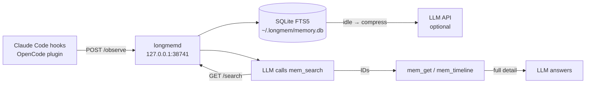

# LongMem

**Persistent memory for [OpenCode](https://opencode.ai) and [Claude Code CLI](https://claude.ai/code) — without freezing your model or polluting your chat.**

A local HTTP daemon captures every tool call, stores it in SQLite with full-text search, and exposes three MCP tools (`mem_search`, `mem_get`, `mem_timeline`) the LLM calls on demand. No auto-injection. No context bloat. The LLM decides when to look up the past.

---

## Why you care

- **Stop repeating yourself.** Architecture decisions, debugging sessions, file locations — searchable across every future session.
- **No freeze.** Compression runs in a separate daemon on its own idle timer, never touching your main model's API slot.
- **Clean chat.** Memory is delivered via MCP tools only when the LLM asks for it — not injected into every message.

---

## Demo

> GIF coming soon: `mem_search` finding a past debugging session in under 1s.

```
mem_search: "authentication bug jwt"
→ [ID:142] 2026-02-28 | Edit | src/auth.ts
    Fixed JWT expiry check — was comparing seconds vs milliseconds

mem_get: [142]
→ Full diff, file paths, concepts: jwt, expiry, middleware
```

---

## Quickstart

### Option A — One-line install (no Bun required)

Standalone binaries are published with each release for macOS (arm64/x64) and Linux (x64).

```bash
# Claude Code CLI only
curl -fsSL https://github.com/clouitreee/LongMem/releases/latest/download/install.sh | bash

# Claude Code CLI + OpenCode
curl -fsSL https://github.com/clouitreee/LongMem/releases/latest/download/install.sh | bash -s -- --all
```

**Verify it worked:**

```bash
curl -s http://127.0.0.1:38741/health
# → {"status":"ok","pending":0,"sessions":0}
```

> **Note:** Binaries are built and published by GitHub Actions on each tagged release. If no release exists yet, use Option B.

---

### Option B — Dev install (requires [Bun](https://bun.sh))

```bash
git clone https://github.com/clouitreee/LongMem.git
cd LongMem
bun install
bun run build          # compile daemon + MCP + hooks
bun run install.ts     # configure Claude Code CLI (default)
# or:
bun run install.ts --all   # configure Claude Code CLI + OpenCode
```

**Verify:**

```bash
curl -s http://127.0.0.1:38741/health
```

---

## Integrations

### A) Claude Code CLI

The installer patches `~/.claude/settings.json` automatically. What gets added:

```json
{
  "hooks": {
    "PostToolUse": [{ "matcher": "", "hooks": [{ "type": "command", "command": "~/.longmem/bin/longmemd --hook post-tool" }] }],
    "UserPromptSubmit": [{ "matcher": "", "hooks": [{ "type": "command", "command": "~/.longmem/bin/longmemd --hook prompt" }] }],
    "Stop": [{ "matcher": "", "hooks": [{ "type": "command", "command": "~/.longmem/bin/longmemd --hook stop" }] }]
  },
  "mcpServers": {
    "longmem": {
      "command": "~/.longmem/bin/longmem-mcp",
      "args": []
    }
  }
}
```

| Hook | What it does |
|------|-------------|
| `PostToolUse` | Sends tool name + input + output to daemon (fire-and-forget) |
| `UserPromptSubmit` | Indexes the user prompt for full-text search |
| `Stop` | Signals session end so the daemon can finalize compression |

All hooks always exit `0` — they never block or break your Claude Code workflow.

---

### B) OpenCode

Install with `--opencode` or `--all`. The installer patches `~/.config/opencode/config.json`:

```json
{
  "instructions": ["~/.opencode/memory-instructions.md"],
  "plugin": ["~/.longmem/plugin.js"],
  "mcp": {
    "longmem": {
      "command": "~/.longmem/bin/longmem-mcp",
      "args": []
    }
  }
}
```

- **`instructions`** — tells the model to call `mem_search` before answering (required for consistent memory use)
- **`plugin`** — hooks into `tool.execute.after`, `session.created`, `session.deleted`, `chat.message`
- **`mcp`** — exposes `mem_search`, `mem_get`, `mem_timeline` as native OpenCode tools

> `experimental.session.compacting` is intentionally **not** used — it caused chat contamination in testing. Context is delivered via MCP tools only.

> **Security:** The daemon binds exclusively to `127.0.0.1:38741`. No data leaves your machine.

---

## How It Works



**Progressive disclosure:**
1. `mem_search` — returns compact index entries (~50 tokens each). Fast, cheap.
2. `mem_get` — fetches full detail for specific IDs. Only what you need.
3. `mem_timeline` — shows what happened before/after a specific observation.

FTS search works immediately on raw tool output — no compression required. Compressed summaries (from a small LLM) improve ranking quality when available.

---

## Configuration

Settings file: **`~/.longmem/settings.json`** (created on first install, `chmod 600`)

```json
{
  "compression": {
    "enabled": true,
    "provider": "openrouter",
    "model": "meta-llama/llama-3.1-8b-instruct",
    "apiKey": "",
    "maxConcurrent": 1,
    "idleThresholdSeconds": 5,
    "maxPerMinute": 10
  },
  "daemon": {
    "port": 38741
  },
  "privacy": {
    "redactSecrets": true
  }
}
```

**Compression is optional.** Without an API key, observations are stored raw and FTS search still works — you just get less refined summaries.

Supported providers: `openrouter`, `openai`, `anthropic`, `local` (Ollama-compatible).

For a custom base URL:
```json
"compression": { "provider": "local", "baseURL": "http://localhost:11434/v1", "model": "llama3.1:8b" }
```

---

## Security & Privacy

**What the daemon redacts automatically** (when `privacy.redactSecrets: true`):

| Pattern | Example |
|---------|---------|
| OpenRouter keys | `sk-or-v1-…` |
| Anthropic keys | `sk-ant-…` |
| OpenAI keys | `sk-…` |
| GitHub PATs / OAuth tokens | `ghp_…`, `gho_…` |
| Slack bot tokens | `xoxb-…` |
| AWS secrets | 20-char key + 40-char value |
| Generic `key=value` secrets | `password=hunter2`, `api_key="abc"` |

**What redaction does NOT guarantee:**
- It won't catch every secret format.
- It won't redact secrets that appear mid-sentence in unusual formats.
- Treat memory output as potentially sensitive — don't log it or expose it.

**`<private>` tag** — wrap anything you never want stored:

```
<private>my database password is xyz</private>
The rest of this message is stored normally.
```

Content inside `<private>` tags is stripped before the observation is written to the DB.

**Local only.** The daemon never makes outbound connections except to your configured compression API (optional, and only during idle windows).

---

## Troubleshooting

**Daemon not running:**
```bash
# Check health
curl -s http://127.0.0.1:38741/health

# Start manually (dev install)
bun run ~/.longmem/daemon.js

# Start manually (binary install)
~/.longmem/bin/longmemd &

# Check logs
tail -f ~/.longmem/logs/*.log
```

**Port already in use:**

Change the port in `~/.longmem/settings.json`:
```json
"daemon": { "port": 39000 }
```
Then restart the daemon. The MCP server and hooks read the same config file, so they will connect to the new port automatically.

**`mem_search` returns nothing:**

The search index is empty until the daemon has captured at least one session. Use Claude Code or OpenCode normally for a session, then search.

**Compression not working:**

Compression is optional. If `apiKey` is empty, observations are stored raw — search still works. Set the key in `~/.longmem/settings.json` to enable AI summaries.

**Circuit breaker tripped (too many compression failures):**

After 5 consecutive compression failures, the worker pauses for 60 seconds. This prevents hammering a misconfigured API. Check your `apiKey` and `model` in settings. The daemon logs will show `[compression] circuit open`.

---

## Uninstall

If you used the binary installer:
```bash
bash ~/.longmem/uninstall.sh
```

This stops the daemon, restores config backups (`.bak` files), and removes `~/.longmem/`.

**Manual uninstall:**
```bash
# Stop daemon
pkill -f longmemd

# Remove data dir (this deletes your memory DB — irreversible)
rm -rf ~/.longmem

# Revert Claude Code config backup
cp ~/.claude/settings.json.bak ~/.claude/settings.json

# Revert OpenCode config backup
cp ~/.config/opencode/config.json.bak ~/.config/opencode/config.json
```

**Purge DB only** (keep install, clear memory):
```bash
rm ~/.longmem/memory.db
# Daemon recreates it automatically on next startup
```

---

## Roadmap

- [ ] Signed releases (minisign / cosign) for binary verification
- [ ] Package managers: Homebrew tap, `.deb`/`.rpm` for Linux
- [ ] Windows hook support (currently daemon + MCP work on Windows; hooks not tested)
- [ ] Memory observatory — local web UI to browse/search/delete observations
- [ ] Per-project memory isolation (currently all projects share one DB with project filtering)
- [ ] `mem_forget` MCP tool — delete observations by ID or pattern

---

## Contributing

```bash
git clone https://github.com/clouitreee/LongMem.git
cd LongMem
bun install
bun run build          # build all targets
bun run dev            # run daemon in dev mode (hot reload)
```

**No automated tests yet** — contributions welcome. See open issues.

Guidelines:
- No secrets in issues, PRs, or logs.
- Keep hooks exit-0 — they must never block the host CLI.
- Daemon must bind `127.0.0.1` only — never `0.0.0.0`.

---

## License

MIT — see [LICENSE](LICENSE).

---

*LongMem stores your coding sessions locally. You own your data.*
